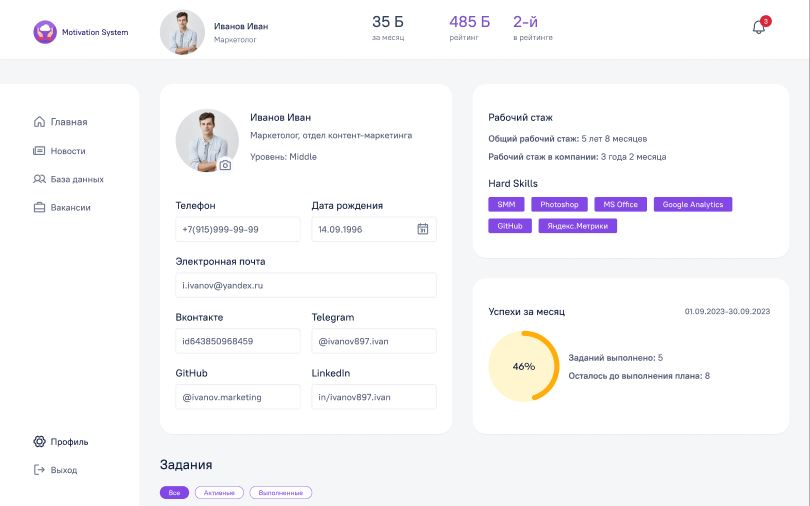

# Motivation System

Совместный проект выпускников Яндекс.Практикума в рамках Акселератора.
На данный момент проект находится в стадии разработки.
В создании принимают участие:

- дизайнеры(Figma),
- frontend-разработчики(React),
- backend-разработчики(Python)
- тестировщики,
- PM

## Описание

Проект разработан с целью мотивирования сотрудников организации. Была реализована система баллов, задач и достижений для сотрудников. И система контроля для руководителей. В приложении руководитель может ставить задачи и вознаграждать сотрудников баллами за выполнение этих задач. У каждого зарегистрированного пользователя есть личный кабинет с возможностью видеть свои успехи, редактировать свои данные и контакты.
Реализована система уведомлений о событиях.

Веб-приложение адаптивно и рассчитано на экраны шириной от 1440px до 360px.

В данном репозитории представлена frontend часть проекта.

Весь проект доступен по ссылке:
http://185.41.163.109/main

Макет: https://www.figma.com/file/Q8r447PYECnLhsfjM8bukI/Мотивация-сотрудников-New?node-id=35640%3A26952&mode=dev

## Технологии:

## Чтобы запустить проект локально:

1. Скачать данный репозиторий
2. npm install - для установки зависимостей
3. npm start - для запуска
4. Приложение запустится на локальном порту по умолчанию(3000) и откроется во вкладке браузера
